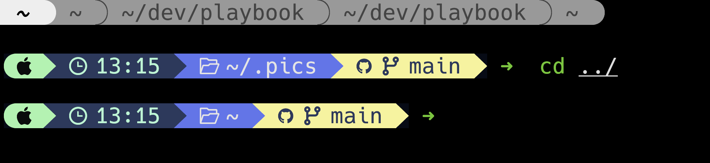
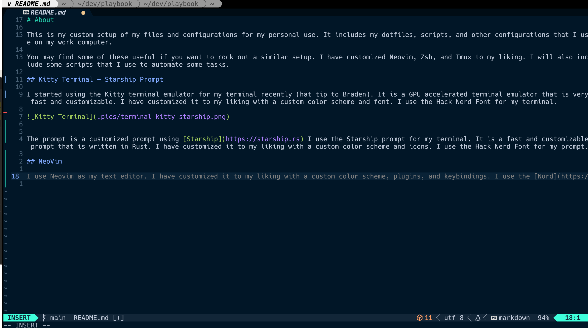
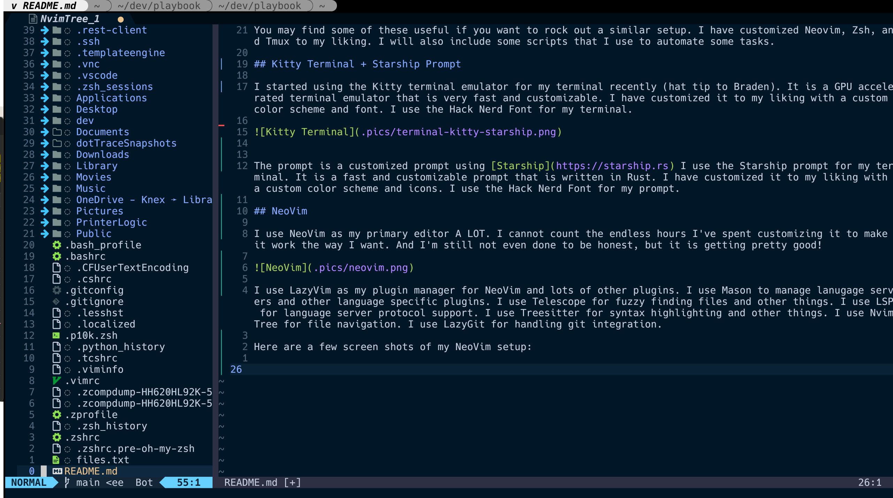
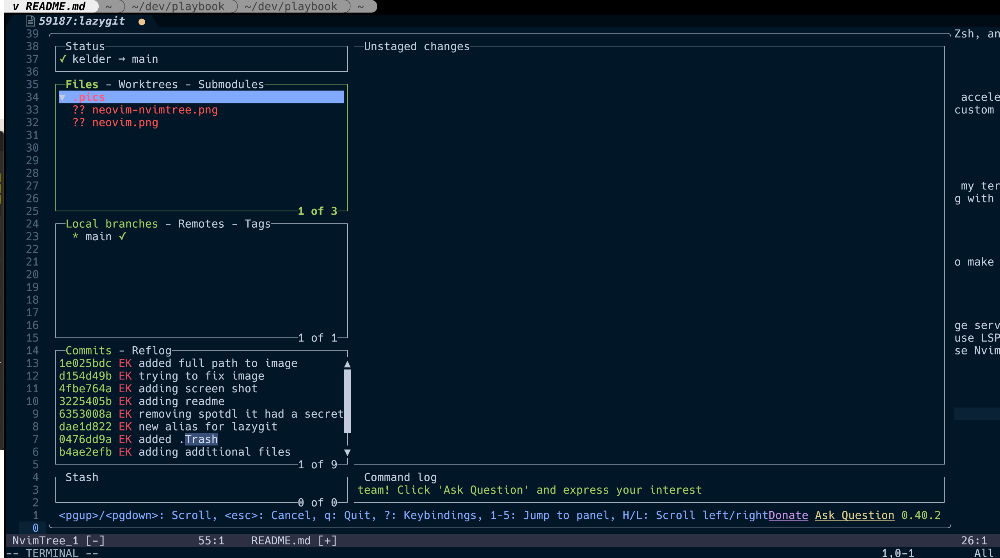
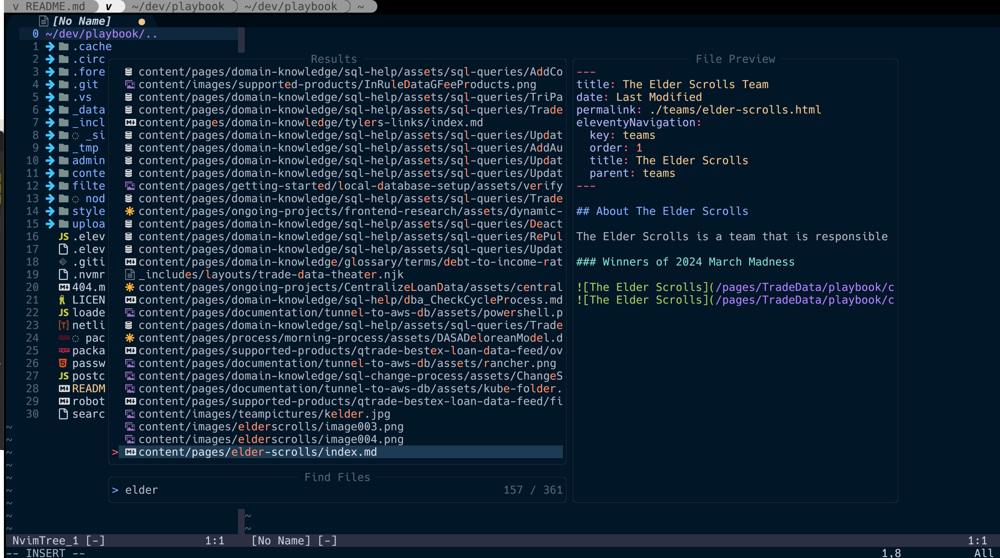

# About

This is my custom setup of my files and configurations for my personal use. It includes my dotfiles, scripts, and other configurations that I use on my work computer.

You may find some of these useful if you want to rock out a similar setup. I have customized Neovim, Zsh, and Tmux to my liking. I will also include some scripts that I use to automate some tasks.

## Kitty Terminal + Starship Prompt

I started using the Kitty terminal emulator for my terminal recently (hat tip to Braden). It is a GPU accelerated terminal emulator that is very fast and customizable. I have customized it to my liking with a custom color scheme and font. I use the Hack Nerd Font for my terminal.



The prompt is a customized prompt using [Starship](https://starship.rs) I use the Starship prompt for my terminal. It is a fast and customizable prompt that is written in Rust. I have customized it to my liking with a custom color scheme and icons. I use the Hack Nerd Font for my prompt.

## NeoVim

I use NeoVim as my primary editor A LOT. I cannot count the endless hours I've spent customizing it to make it work the way I want. And I'm still not even done to be honest, but it is getting pretty good!



I use LazyVim as my plugin manager for NeoVim and lots of other plugins. I use Mason to manage lanugage servers and other language specific plugins. I use Telescope for fuzzy finding files and other things. I use LSP for language server protocol support. I use Treesitter for syntax highlighting and other things. I use NvimTree for file navigation. I use LazyGit for handling git integration.

Here are a few screen shots of my NeoVim setup in action:

### NeoVim with NvimTree



### NeoVim with LazyGit



### NeoVim with Telescope



# How To Setup

I'm using GNU stow to manage my dotfiles. You can install it with the following command on MacOS:

```
brew install stow
```

```
git clone <repo>
```

Once installed, you can clone this repository and run the following command to symlink the dotfiles to your home directory:

```
cd dotfiles

# CAREFUL: This will symlink the dotfiles to your home directory and overwrite any existing files.
stow --adopt .
```
